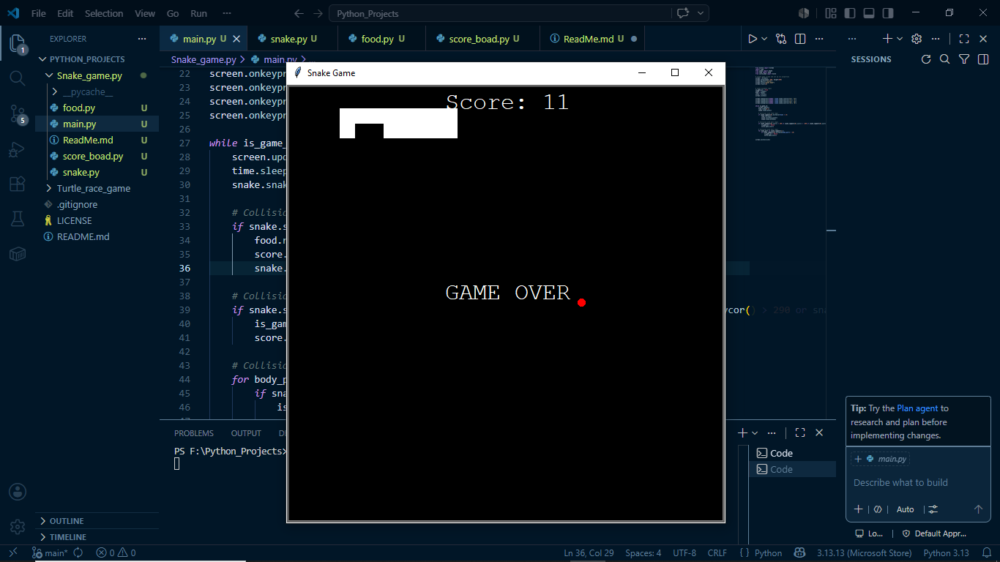

# 🐍 Snake Game

A classic Snake Game built using Python and the Turtle Graphics module with Object-Oriented Programming (OOP) principles.

## 🎮 Features

* Snake moves smoothly using keyboard controls
* Snake grows longer whenever it eats food
* Real-time score tracking
* Random food generation
* Game Over when the snake hits the wall
* Game Over when the snake collides with its own tail
* Built using multiple classes following OOP concepts
* Persistent high score using file handling

## 🛠 Technologies Used

* Python
* Turtle Graphics
* Object-Oriented Programming (OOP)

## 📂 Project Structure

```text
Snake_Game
│
├── main.py
├── snake.py
├── food.py
├── scoreboard.py
```

## 🚀 How to Run

1. Clone the repository:

```bash
git clone <your-repository-link>
```

2. Open the project folder.

3. Run:

```bash
python main.py
```

## 🎯 Controls

| Key | Action     |
| --- | ---------- |
| W   | Move Up    |
| S   | Move Down  |
| A   | Move Left  |
| D   | Move Right |

## 📸 Demo

Add a screenshot or gameplay video here.

Example:

```markdown

```

## 📚 What I Learned

Through this project, I learned:

* Object-Oriented Programming (OOP)
* Working with multiple Python modules
* Event handling and keyboard input
* Collision detection
* Score management
* Game development fundamentals
* Project organization using Git and GitHub

## 🔮 Future Improvements

* High Score System
* Pause/Resume Feature
* Difficulty Levels
* Sound Effects
* Better Graphics and Animations


## ✨ New Feature

- Added a persistent high score system.
- High score is stored in a local text file.
- The game automatically loads the previous high score every time it starts.
- If the player beats the existing high score, the new record is saved automatically.
---

Created by **Sahil** 🚀
